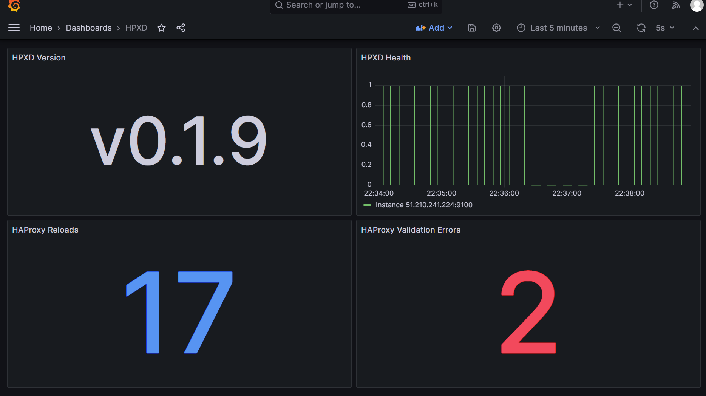

# hpxd

`hpxd` is a daemon that runs on a node and manages the state of HAProxy. It listens for changes from a specified Git repository and updates the HAProxy configuration accordingly.

[](https://github.com/zcubbs/hpxd/releases)

[](https://pkg.go.dev/github.com/zcubbs/hpxd)
[](https://github.com/zcubbs/hpxd/actions/workflows/lint.yaml)
[](https://github.com/zcubbs/hpxd/actions/workflows/scan.yaml)

[](https://goreportcard.com/report/github.com/zcubbs/hpxd)
[](./LICENSE)

---
<p align="center">
</p>
<p align="center">
  
</p>

---

## Features

- **Dynamic Configuration Updates**: Polls a Git repository for changes in HAProxy configuration and applies them dynamically.
- **Prometheus Metrics**: Provides metrics on Git pull successes/failures, HAProxy reloads, and configuration validation.
- **Cross-Platform**: Builds available for Linux (`amd64` and `arm64`).

## Installation

### From Binary

You can download the latest release from [here](https://github.com/zcubbs/hpxd/releases).

If you prefer to install using a script:

```bash
curl -sfL https://raw.githubusercontent.com/zcubbs/hpxd/main/scripts/install.sh | sudo bash -s -- \
    --repo-url https://github.com/yourusername/haproxy-configs.git \
    --branch main \
    --path /path/to/file/in/repo/haproxy.cfg \
    --haproxy-config-path /path/to/haproxy.cfg
```

### From Source

```bash
go get github.com/zcubbs/hpxd
cd $GOPATH/src/github.com/zcubbs/hpxd
go install ./...
```

## Usage

You'll need a configuration file (by default, the tool looks for ./configs/hpxd.yaml).

```yaml
repoURL: https://github.com/yourusername/haproxy-configs.git
branch: main
haproxyConfigPath: /path/to/haproxy.cfg
pollingInterval: 5s
enablePrometheus: true
prometheusPort: 9100
```

Then, run the tool:

```bash
hpxd -c /path/to/config.yaml
```

## Monitoring Metrics

Monitoring is available for the application, and the following metrics are tracked:

- **hpxd_git_pulls_total**:
    - Description: Total number of times the config is pulled from Git.
    - Labels: `status` (values: success or failure).

- **hpxd_haproxy_reloads_total**:
    - Description: Total number of times HAProxy is reloaded.

- **hpxd_invalid_configs_total**:
    - Description: Total number of times an invalid config is detected.

- **application_info**:
    - Description: Provides application details such as version, commit, and build date.
    - Labels: `version`, `commit`, `buildDate`.

These metrics can be accessed via Prometheus and visualized using Grafana.



## Development

> Prerequisites
> - Docker (https://rancherdesktop.io/)
> - Task (https://taskfile.dev/#/installation)
> 

### Setup Development Environment

#### 1. Build the development Docker image:
    
```bash
task build-docker-dev
```

#### 2. Run the development Docker container:

```bash
task run-docker-dev
```

#### 3. Build and test your Go project:

```bash
task build
task test
```

#### 4. Install/Uninstall:

```bash
task install
task uninstall
```

### Contributing

Contributions are welcome! Please read the contribution guidelines before submitting a pull request.

### License

This project is licensed under the MIT License. See the [LICENSE](LICENSE) file for details.

### Support and Feedback

If you need support or have any feedback, please open an issue [here](https://github.com/zcubbs/hpxd/issues/new)
